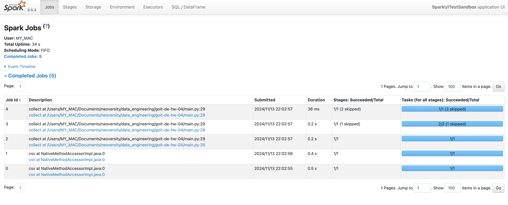
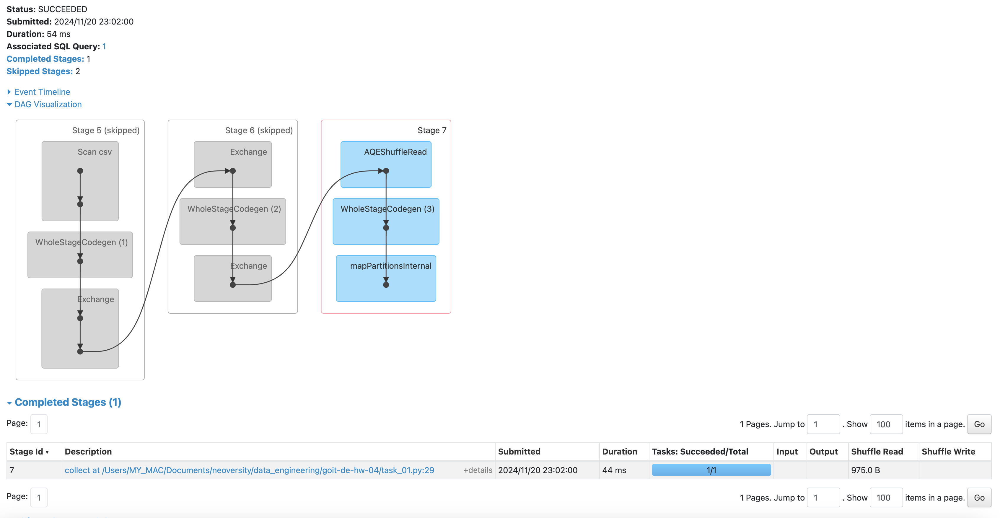
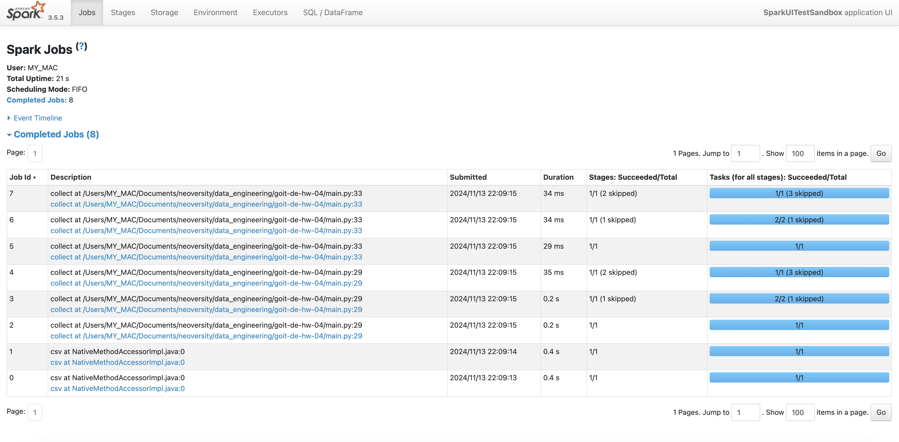
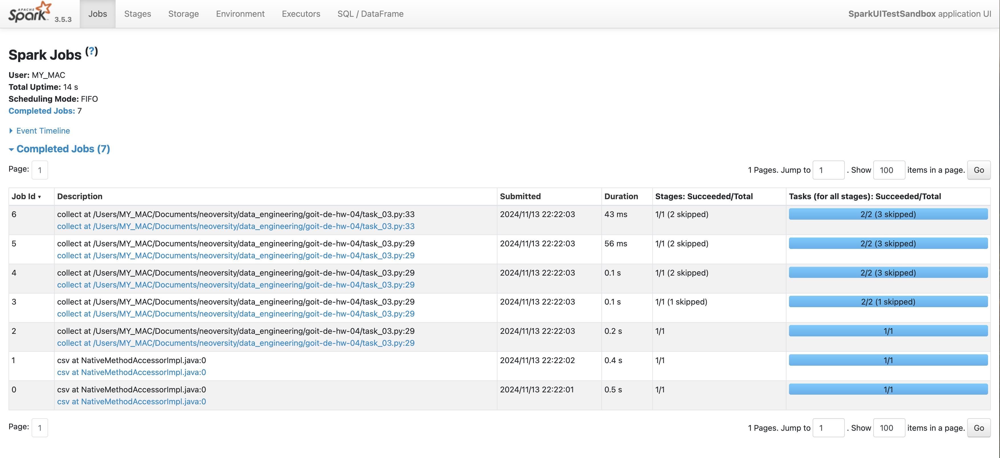
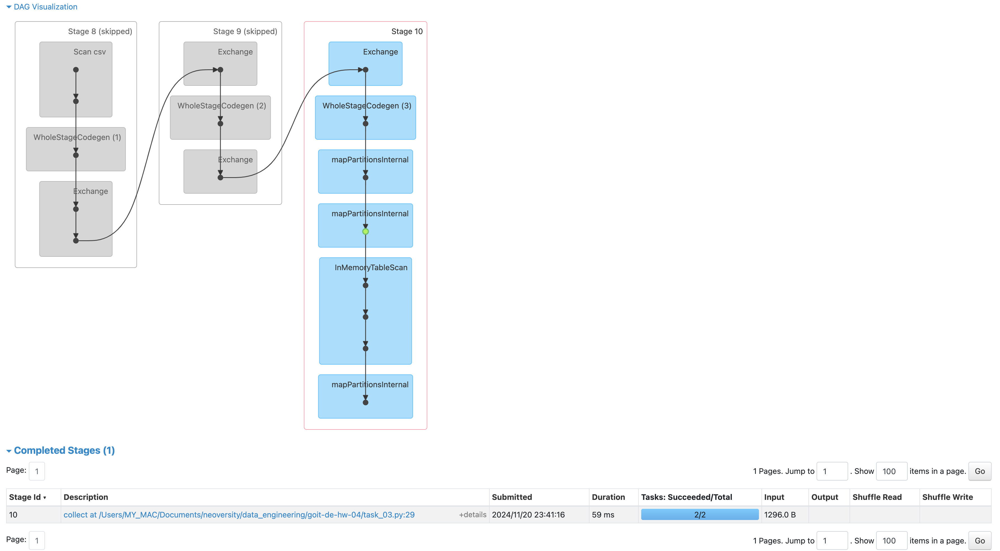

# goit-de-hw-04
Data Engineering. Apache Spark optimisation and SparkUI

This project focuses on creating and optimizing Apache Spark jobs, analyzing the results using SparkUI. We run a single codebase with incremental changes to compare performance metrics in SparkUI. After executing one of the scripts (task_01.py, task_02.py, or task_03.py), SparkUI can be accessed at http://localhost:4040.

1. [task_01.py](task_01.py)

Executing task_01.py yields the following results:

Observation:
 - Five jobs are created:
 - Two jobs are related to reading the CSV file.
 - Three jobs are triggered by the transformations called during the collect() action.

If we examine the last job, we see the following:

Details:
 - Skipped Stages: Two stages are skipped because they were already executed by prior jobs.
 - Stage 1: Shows the process of scanning the CSV file and data shuffling between nodes.
 - Stage 2: Represents the groupBy() transformation, which causes data shuffling (shuffle read and shuffle write).
 - Final Stage: Results from the collect() action, retrieving data from the nodes.

2. [task_02.py](task_02.py)
This script is similar to task_01.py, but with one additional intermediate action: collect(). The resulting job execution is as follows:

Observation:

 - Eight jobs are created, compared to five in task_01.py.
 - Adding a single collect() action results in three additional jobs.
 - 
Details:

 - Jobs 6, 7, and 8 are duplicates of jobs 3, 4, and 5, respectively.
 - These duplicated jobs performed exactly the same operations as jobs 3, 4, and 5 and are described in details in previous section.
 - Additional collect() action re-triggers all transformations (select(), groupBy(), count()), causing the repeated execution of these jobs.

3. [task_03.py](task_03.py)
This script builds upon task_02.py by introducing one additional action: cache() at the end of the data transformation chain. The resulting job execution is as follows:

Observation:
 - Seven jobs are created, compared to eight in task_02.py.
 - The first five jobs remain identical to those in task_02.py.
 - The last two jobs are distinct and do not duplicate prior jobs as seen in task_02.py.

Details:
 - The InMemoryTableScan process appears in jobs 6 and 7.
 - With the cache() action, data is stored in RAM, eliminating the need to reload and reprocess them.
 - As a result, there is no data shuffling, and no repeated jobs are executed.

Conclusion
This project demonstrates how minor changes to Spark code—such as adding collect() or cache() actions—affect job execution and resource utilization. Using cache() can significantly optimize performance by reducing redundant operations and avoiding unnecessary data shuffling.